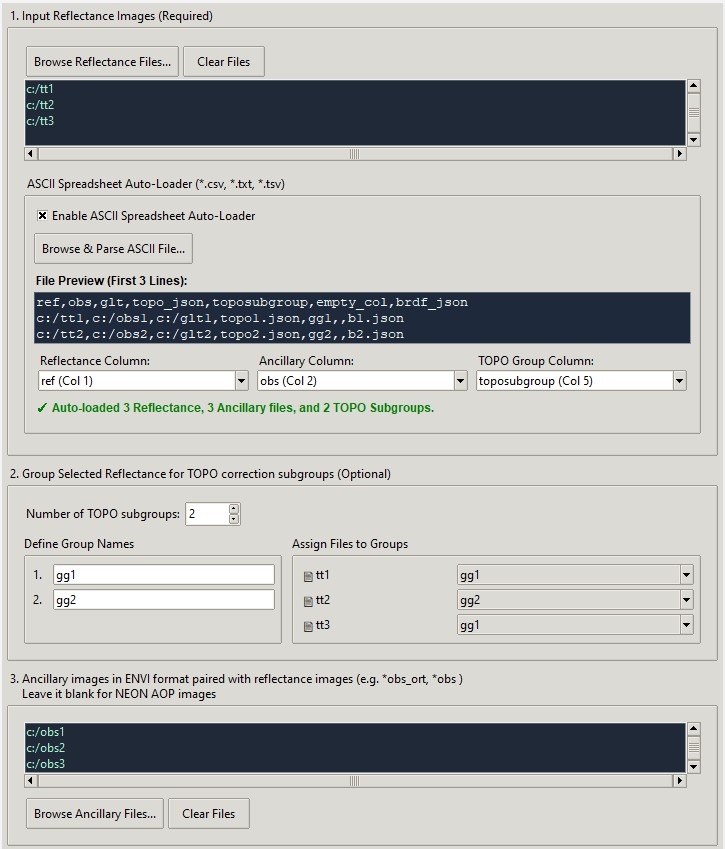
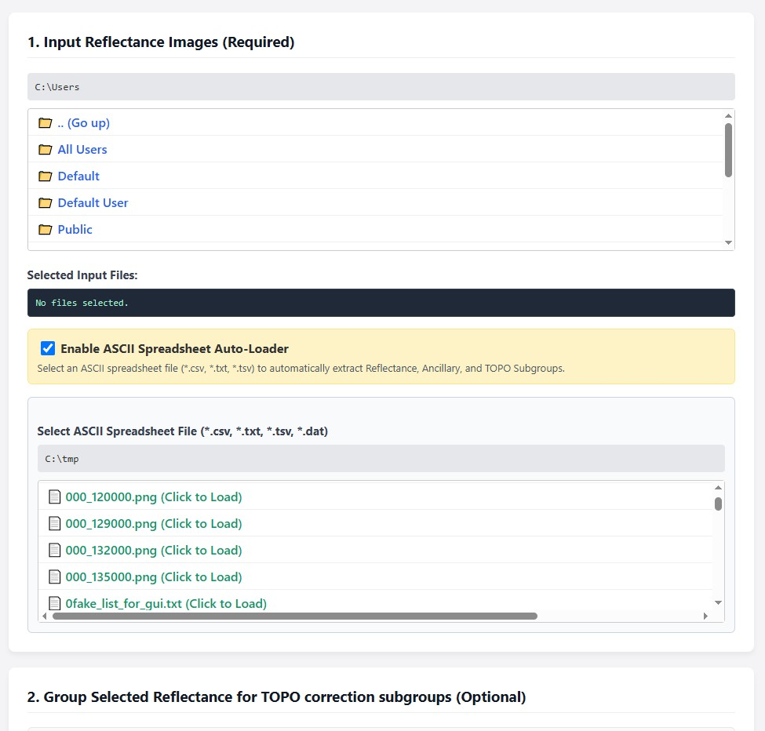
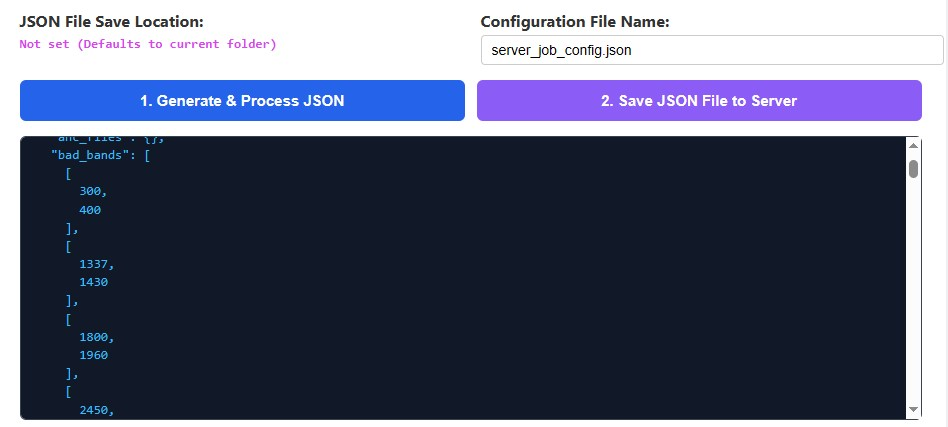
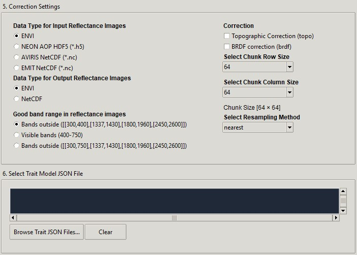

# Graphical User Interface (GUI) for generating JSON configuration

## 1. GUI for image correction

For generating image correction configuration, two simple GUIs are provided, one for local environment and the other for remote server environment. An alternative for the same task is a generating script [image_correct_json_generate.py](https://github.com/EnSpec/hytools/blob/master/scripts/configs/image_correct_json_generate.py), which can has more customized settings if modified by user.

Basically, it is recommended to have one configuration file for one image group. Images can be in the same group if they are geographically and temporally close, such as images acquired on the same day from the same flight campaign. The GUI provides the possibility to select all images in the same group and their ancillary images if necessary, and save all the paths in the same configuration file. This make sure all images are processed in the same settings.

### 1.1 Local version


[Local version](https://github.com/EnSpec/hytools/blob/master/scripts/configs/image_correct_json_generate_gui_local.py)

Run this script to launch the GUI if the local machine support graphical interface.
```bash
python image_correct_json_generate_gui_local.py
```

User can manually select multiple reflectance images to group them in the workflow. If necessary, ancillary images and GLT images can be selected separately. All three lists presumably have one-to-one relationship, and have the same alphabetical order. The GUI will check if the total number of these three file lists match with each other.


To improve the consistency of the reflectance images and other related images, user can also provide a spreadsheet of the file list, which inherently contains the paring information. The spreadsheet can have columns of ancillary images, and subgroup information for TOPO correction. A simple parser of the spreadsheet information can fill out the file lists in the first three sections of the GUI.




After input files selection is finished, user can choose which brightness adjustments are implemented with various flavors, and how to save the output. The result can be the data-driven correction model coefficients saved in JSON format, so that some time-consuming correction model estimation procedure is not repeated in the different downstream image generating procedures.


### 1.2 Web GUI for remote server

[Remote server version](https://github.com/EnSpec/hytools/blob/master/scripts/configs/image_correct_json_generate_gui_remote.py)
In situation that user cannot get access to the graphical interface of the remote server where the data are stored and processed, a web-based GUI can be used to setup the configuration. More dependencies are required.

#### Step 1. SSH Local Port Forwarding

```bash
ssh -L port_number_of_local:localhost:port_number_of_server user_name@remote_server_ip
```
One example of the ```port_number_of_local``` can be ```8080```, and ```port_number_of_server``` can be ```5005```.

#### Step 2. Launch server

```bash
python image_correct_json_generate_gui_remote.py
```
The default port is 5005, which can be changed by the user.

```bash
python image_correct_json_generate_gui_remote.py  port_number_of_server
```


#### Step 3. Open GUI in the browser

Use "*localhost:port_number_of_local*" in the address box of the browser like ```localhost:8080```.


The server version has the identical functions of the local version, although the visual design has some differences.



Like the local version, user can preview the generated JSON contents before saving the resultant JSON configuration file to the server. If there is warning, the save operation cannot proceed.



## 2. GUI for trait mapping

For generating trait mapping configuration, simple GUIs are provided. An alternative for the same task is a generating script [trait_estimate_json_generate.py](https://github.com/EnSpec/hytools/blob/master/scripts/configs/trait_estimate_json_generate.py).

GUIs also have two versions ([Local Version](https://github.com/EnSpec/hytools/blob/master/scripts/configs/trait_estimate_json_generate_gui_local.py), [Remote Version](https://github.com/EnSpec/hytools/blob/master/scripts/configs/trait_estimate_json_generate_gui_remote.py)). At least one trait models saved in JSON format ([example](https://github.com/EnSpec/hytools/blob/master/scripts/configs/plsr_model_format_v0_1.py)), which stores the linear predictive model parameters and related transformation, is required.



To launch the remote server version, SSH local port forwarding is required (same as "Web GUI for remote server" mentioned above).