# Features and Workflows of HyTools


[](https://zenodo.org/badge/latestdoi/315419247)

[](https://www.gnu.org/licenses/gpl-3.0)

HyTools is a python library for processing airborne and spaceborne imaging spectroscopy data, supporting simultaneous brightness adjustment and normalization on large datasets. 


## Highlights

At its core it consists of functions for 

* Spectral resampling, topographic, BRDF (e.g. [FlexBRDF](https://doi.org/10.1029/2021JG006622)) and [sunglint](https://doi.org/10.1029/2021JG006712) correction, spectral transforms, masking and more;
* A series of command line tools which combine these functions and provide a streamlined workflow for processing images ([tutorial](./FlexBRDF_tutorial_rtd.md));
* Utilizing [Ray](https://github.com/ray-project/ray) to speed up group image processing, and [an alternative of FlexBRDF correction](./separated_flexbrdf_rtd.md) without Ray,
* Reading ENVI formatted images, NEON AOP HDF files, NetCDF (EMIT and AVIRIS) images with Geographic Lookup Table (GLT) [support](./netcdf_glt_rtd.md);
* Writing ENVI and NetCDF images.

For examples see the HyTools basics ipython notebook [here](https://github.com/EnSpec/hytools/blob/master/examples/hytools_basics_notebook.ipynb).


## Features

### Main Functions
| Function | ------------ | Description |
| :--- | :---: | :--- |
| BRDF correction  | 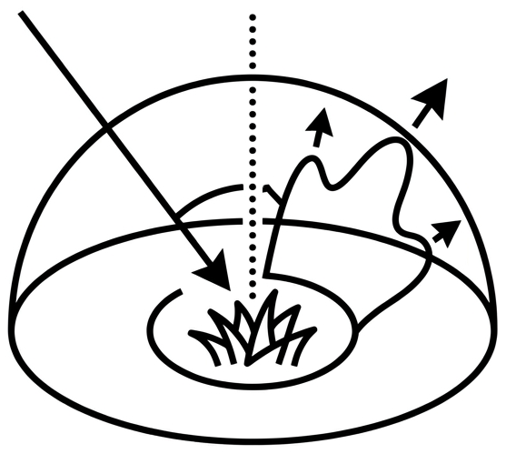 | Reduce variation in reflectance due to different sun-target-sensor geometry|
| Topographic correction | 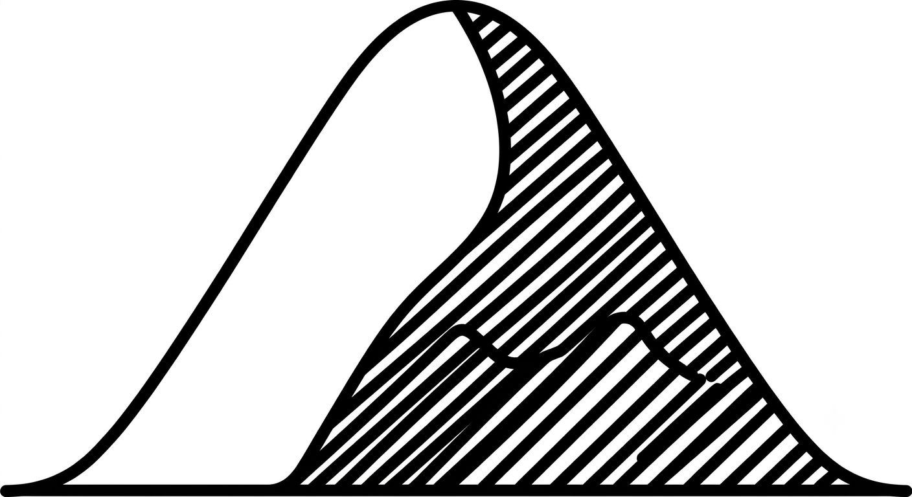  | Reduce variation in reflectance due to topographic difference |
| Sunglint correction |  | Reduce variation in reflectance due to mirror-like specular reflection of sunlight off the water|
|Trait mapping| | Use linear predictive model to map various pixel-wise traits from reflectance |
|Spectral resampling| 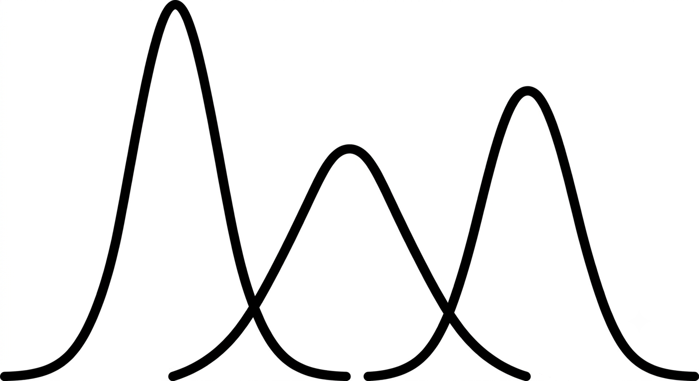 | Resample spectra by various methods |
|Spectral transformation|  | Calculate various spectral variables from pixel-wise band  arithmetic operations, including PCA transformation, normalized difference indices |
|Data extraction|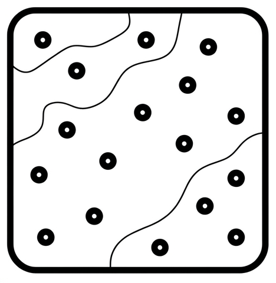 | Extract spectral data from images based on scattered locations, wavelengths, columns, rows or chunks |
|Masking| | Image mask generation based on thresholding |

### Supports of image I/O
| Function | Key name in configuration file or parameter name in function | Format Name | Description
| :--- | :--- |:--- |:--- |
| Read | <i>file_type</i> | <i>envi</i><br> <i>neon</i><br> <i>emit</i><br> <i>ncav</i> |ENVI <br> NEON AOP HDF5 <br>EMIT NetCDF <br>AVIRIS NetCDF|
| Write | <i>export</i> : <i>image_format</i><br><i>export_type</i> | <i>envi</i><br><i>netcdf</i> | ENVI<br>NetCDF|


### Scripts 


When running scripts, the setting of parameters are specified in configuration file in JSON format. It controls the input and output path, the ways of correction and related settings, mask exportation, etc.. This setting makes it easier to reproduce the data processing workflow.

For small amount of target images, a [GUI](./GUI_rtd.md) with several default options can be used to setup the configuration file. For larger datasets with more images, or with more customized settings, the [python script for generating JSON configuration file](https://github.com/EnSpec/hytools/blob/master/scripts/configs/image_correct_json_generate.py) is recommended.

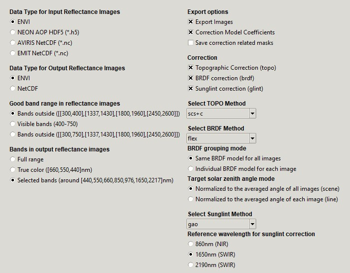


By running the script below with the configuration file, correction related images or coefficients will be saved. As most of the correction models considered are semi-empirical, saving the model coefficients derived from input images can reduce computing time for future correction applications.
```bash
python image_correct.py image_correct_config.json
```

If only the *Correction Model Coefficients* ("coeffs") is checked, no image will be exported, but the correction model coefficients will be saved and they can be reused in other workflow runs. TOPO and BRDF JSON coefficients files will be saved in the case below, which can be applied in different downstream workflows.

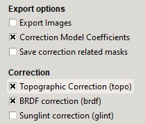

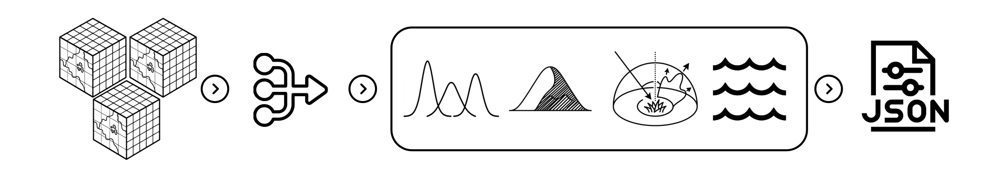


When the corrected images is really needed, the workflow with a different config file can generate the results. Here the new JSON can be named "image_correct_config_precomputed.json", with the imported precomputed TOPO and BRDF JSON coefficients files for each image. 

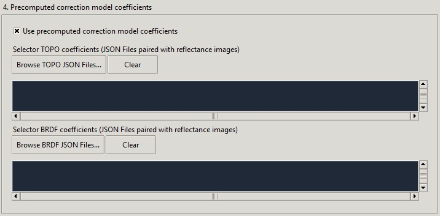

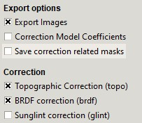

```bash
python image_correct.py image_correct_config_precomputed.json
```
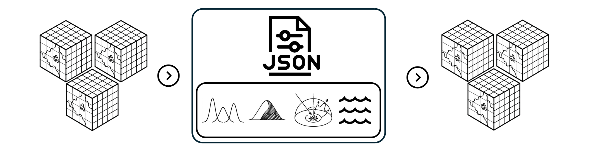

Correction can also be applied to image subset (e.g. point and chunk) on the fly in memory with the precomputed coefficients.

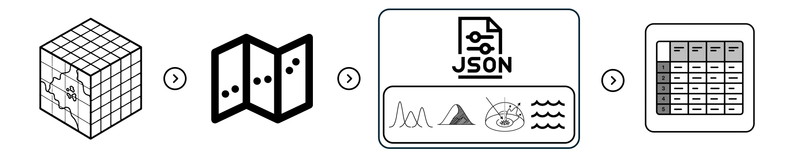

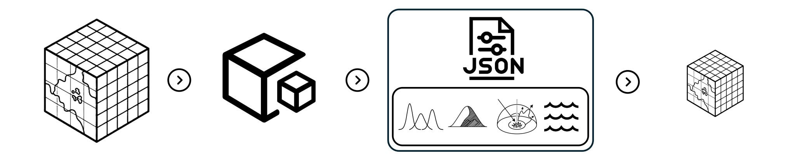


With precomputed correction coefficients and multiple trait prediction model coefficients, multiple trait maps can be generated in a parallel manner by the script below. The trait mapping configuration file can also be generated by a script [trait_estimate_json_generate.py](https://github.com/EnSpec/hytools/blob/master/scripts/configs/trait_estimate_json_generate.py).
```bash
python trait_estimate.py map_trait_config.json
```

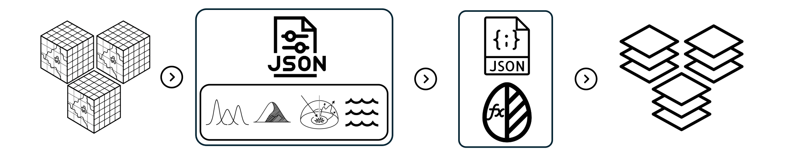

Please visit this [page](./FlexBRDF_tutorial_rtd.md) for more details about the image brightness adjustment workflow and the trait mapping workflow for large amount of images. For a solution for processing images in a more distributed way, please visit this [page](./separated_flexbrdf_rtd.md). For I/O support on imaging spectroscopy imagery with different formats and geocoding, please visit this [page](./netcdf_glt_rtd.md).

## Related Publications
[1] Queally, N., Ye, Z., Zheng, T., Chlus, A., Schneider, F., Pavlick, R. P., & Townsend, P. A. (2022). FlexBRDF: A flexible BRDF correction for grouped processing of airborne imaging spectroscopy flightlines. *Journal of Geophysical Research: Biogeosciences*, *127*(1), e2021JG006622. 
https://doi.org/10.1029/2021JG006622

[2] Greenberg, E., Thompson, D. R., Jensen, D., Townsend, P. A., Queally, N., Chlus, A., et al. (2022). An improved scheme for correcting remote spectral surface reflectance simultaneously for terrestrial BRDF and water-surface sunglint in coastal environments. *Journal of Geophysical Research: Biogeosciences*, *127*(1), e2021JG006712.
https://doi.org/10.1029/2021JG006712

## License
HyTools is licensed under GPL-3.0 license.
