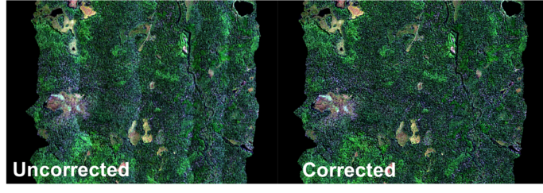
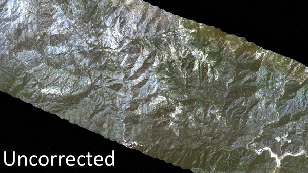

About HyTools
=====================

HyTools is a python library for processing airborne and spaceborne
imaging spectroscopy data, with a focus on terrestrial scenes. At it's
core it consists of functions for reading and writing
`ENVI <https://www.l3harrisgeospatial.com/docs/ENVIImageFiles.html>`_
formatted images and reading `NEON AOP
<https://www.neonscience.org/data-collection/airborne-remote-sensing>`_
HDF files along with series of image processing functions including
spectral resampling, topographic and BRDF correction, spectral
transforms, masking and more. We have also created a series of command
line tools which combine these functions and provide a more
streamlined workflow for processing images.

Examples
--------

BRDF correction
~~~~~~~~~~~~~~~

Topographic correction
~~~~~~~~~~~~~~~~~~~~~

