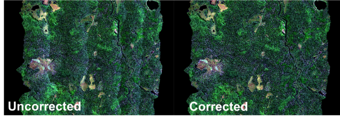
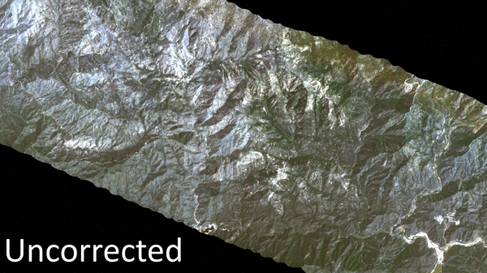
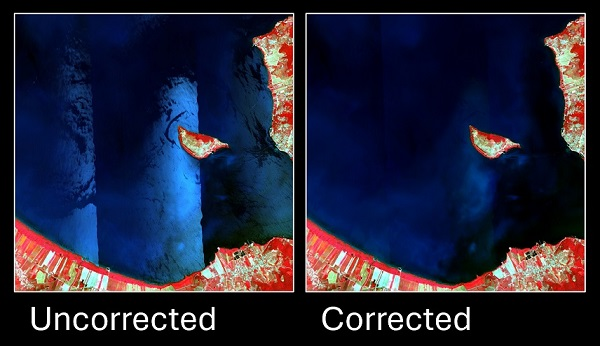

About HyTools
=====================

HyTools is a python library for processing airborne and spaceborne
imaging spectroscopy data, with a focus on terrestrial scenes, supporting 
simultaneous brightness adjustment and normalization on large datasets. At it's
core it consists of functions for

* Spectral resampling, topographic, BRDF (e.g. FlexBRDF) and sunglint correction, spectral transforms, masking and more;
* A series of command line tools which combine these functions and provide a streamlined workflow for processing images;
* Utilizing Ray to speed up group image processing, and an alternative of FlexBRDF correction without Ray;
* Reading `ENVI <https://www.l3harrisgeospatial.com/docs/ENVIImageFiles.html>`_ formatted images , `NEON AOP <https://www.neonscience.org/data-collection/airborne-remote-sensing>`_ HDF files, NetCDF (EMIT and AVIRIS) images with Geographic Lookup Table (GLT) support;
* Writing ENVI and NetCDF images.

Examples
--------

BRDF correction
~~~~~~~~~~~~~~~

.. raw:: html
	 
  <embed>

  <link rel="stylesheet" href="/_static/css/slider.css">
  

  

     
     

        
     

   

   

   </embed>

  

Topographic correction
~~~~~~~~~~~~~~~~~~~~~~

Sunglint correction
~~~~~~~~~~~~~~~~~~~

