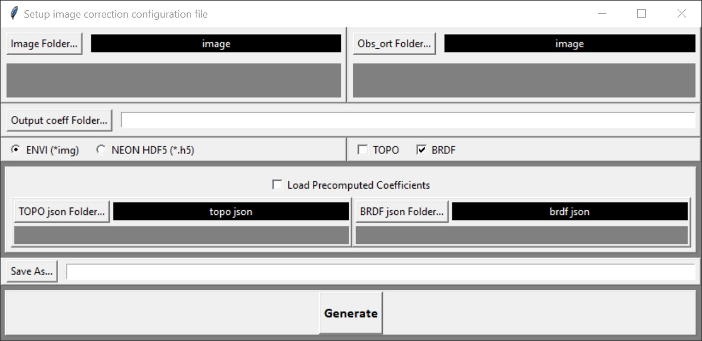

# FlexBRDF 
This is a tutorial on how to implement FlexBRDF [[1](#Reference)] to normalized illumination conditions with  Bidirectional Reflectance Distribution Function (BRDF) in hyperspectral image like AVIRIS-NG. Specially, it it about correcting the images with the terminal command line script.


## 1. Preparation
Reflectance images and their ancillary datasets are required in order to generate BRDF-corrected reflectance images. Ancillary datasets include solar zenith and azimuth angles, sensor viewing zenith and azimuth angles. Slope and aspect for the terrain are needed for the optional topographic correction. For AVIRIS-like dataset, ancillary dataset is stored in the *\*_obs_ort / \*_obs* file from the L1B package , while the reflectance dataset is in the L2 package ([AVIRIS-Classic](https://aviris.jpl.nasa.gov/dataportal/20170911_AV_Download.readme)/[AVIRIS-NG](https://avirisng.jpl.nasa.gov/dataportal/ANG_L1B_L2_Data_Product_Readme_v02.txt)). For NEON AOP dataset, the ancillary datasets come along with the reflectnace dataset in the [HDF5 files](https://www.neonscience.org/resources/learning-hub/tutorials/neon-refl-h5-py).

HyTools and its dependencies are properly [installed](https://github.com/EnSpec/hytools/tree/master#installation). It can be verified with the testing code in this [section](https://github.com/EnSpec/hytools/blob/master/README.md#basic-usage).

## 2. Configuration

All settings and file paths are specified in a JSON file, which is foremost in the execution of the full procedure. They are supposed to be setup before the actual execution. Some configuration templates can be found [here](https://github.com/EnSpec/hytools/tree/master/examples/configs). 


To change the settings for specific purposes, user can either directly edit the sample configuration json file, or run the script below to generate a new configuration json file with modified settings.

```bash
python ./scripts/configs/image_correct_json_generate.py
```
A new json file will be generated according to the setting. 

Default and recommended settings are described in [this example configuration file](https://github.com/EnSpec/hytools/blob/master/examples/configs/topo_brdf_glint_correct_config.json). The keys settings are introduced in the coming parts.

#### Choose what to export in the correction outputs
The *export* part in the configuration determines whether the BRDF model estimation part or the BRDF model application part is to be executed or not. These two parts can be done separatedly in order or done together on the fly.
```json
"export": {
      "coeffs": false,
      "image": true,
      "masks": true,
      "subset_waves": [],
      "output_dir": "/data2/avng/l2/hytools_avng_example/",
      "suffix": "topo_brdf_glint"
},
```
  * The main results of the whole correction procedure are the images and the correct coefficients. At least one of their exportations should be enabled (set to *true*). *coeffs* can be *true* so that they can be saved for future use, called '*precomputed*' coefficients. 
  * Mask layers produced during the procedure can also be saved if both *image* and *masks* are *true*.
  * *subset_waves* is the list denoting which band to export. They are specified by closest wavelgths in nanometers, e.g. ```[440,550,660]``` for a 3-band exportation in the visible range. Empty list ```[]``` means exporting the full image cube.
  * *output_dir* and *suffix* are the about the final location and suffix of the outputs.

#### Choose how to correct the images
Currently, there are three corrections ([TOPO](#TOPO), [BRDF](#BRDF), [Glint](#glint)) user can choose from in HyTools. They can all be enabled.
```json
"corrections": [
      "topo",
      "brdf",
      "glint"
],
```
Order matters in the correction. Some common settings are shown as below.
|Correction Setting|Meaning|
|---|---|
|[ ]|Empty, no correction|
|['topo']|Topographic correction only|
|['brdf']|BRDF correction only, for flat regions|
|['topo','brdf']|TOPO correction, then BRDF correction|
|['brdf','glint']|BRDF first, then Glint correction|
|['topo','brdf','glint']|Three corrections in order|

#### TOPO
 Options for topographic methods are ['scs','scs+c','c','cosine','mod_minneart'], corresponding to sun-canopy-sensor method[[2](#Reference)], sun-canopy-sensor+C method[[2](#Reference)], C method[[3](#Reference)], cosine method [[3](#Reference)], and modified Minnaert method [[3](#Reference)], respectively. The recommended method for topographic correction is "scs+c".
```json
"topo": {
      "type": "scs+c",
      ... ...
      ... ...
},
```


#### BRDF

Options for BRDF correction methods are ['flex','universal'], corresponding to FlexBRDF method [[1](#Reference)] and universal method.

Geometric kernel can be selected from ['li_sparse','li_dense','li_dense_r','li_dense_r','roujean'].
Volumetric kernel can be selected from['ross_thin','ross_thick','hotspot','roujean'].

```json
"brdf": {
    "type": "flex",
    "grouped": true,
    "geometric": "li_dense_r",
    "volume": "ross_thick",
      ... ....
      ... ....      
    "bin_type": "dynamic",
    "num_bins": 18,
    "ndvi_bin_min": 0.05,
    "ndvi_bin_max": 1.0,
    "ndvi_perc_min": 10,
    "ndvi_perc_max": 95,
    "solar_zn_type": "scene"
},   
```
Although each flight line can be BRDF-corrected independently, it is recommnded in FlexBRDF to put all lines in the same day and at close geographical location in the same group, and estimate the shared BRDF correction coefficients.

FlexBRDF uses NDVI to discriminate various land cover type. It dynamically use N bins of NDVI within an NDVI range. By default, pixels in the flight group will be binned into 18 subgroups based on NDVI percentiles. BRDF coefficients are estimated within each subgroup. Pixels outside [*ndvi_bin_min*, *ndvi_bin_max*] are not included for statistics.

Under the setting of BRDF correction, all pixels in the same BRDF flightline group will ultimated be normalized to the illumination condition at the average solar zenith angle of the whole 'scene'.


```json
"num_cpus":2,
```
If there are more than one flightline in the group for the purpose of BRDF correction, refelctance image should pair with its ancillary file in the confiuration json file. This also means the order of the file list ("*input_files*" and "*anc_files*") in the configuration should match with each other. Basically, the number of CPU assigned to RAY should also match the total number of flightlines. In the example, there are two flightlines.


#### Glint

Options for glint correction include ['hochberg','gao','hedley'], corresponding to the method Hochberg et al., 2003[[4](#Reference)], Gao et al., 2021[[5](#Reference)], and Hedley et al. 2005[[6](#Reference)].

#### A simplified GUI for generating congig file
This [python-based GUI](https://github.com/EnSpec/hytools/blob/master/scripts/configs/image_correct_json_generate_gui.py) only provides the least options for generating image correction configuration file. It has the most of the functions of [image_correct_json_generate.py](https://github.com/EnSpec/hytools/blob/master/scripts/configs/image_correct_json_generate.py), but it assumes files of the same group are exclusively in the same directory. It does not provide all the options, and it is rather an example of how the configuration is generated.




## 3. Execution

The actual script for correcting images is [image_corret.py](https://github.com/EnSpec/hytools/blob/master/scripts/image_correct.py). It can either estimate BRDF coefficients, or perform image correction using the coefficients precomputed or on the fly to generate resultant image. 

```bash
python ./scripts/image_correct.py path/to/the/configuration/json/file
```

Depending on the configuration settings, various outputs are got in this step.

If image export is enabled, a full image cube ( ```"subset_waves": []```), or a band-subset of image cube (```subset_waves": [wavelength1,wavelength2,wavelength3,...] ```). 

A separated mask file will be generated if both *image* and *mask* is set to *true* in the *export* part of the configuration.

All resultant images are in ENVI format. 

If TOPO/BRDF model coefficients export is enabled, they will be stored in JSON format, and can be used as precomputed coefficients in other hytools scripts ([image_correct_json_generate.py](https://github.com/EnSpec/hytools/blob/master/scripts/configs/image_correct_json_generate.py) or [trait_estimate_json_generate.py](https://github.com/EnSpec/hytools/blob/master/scripts/configs/trait_estimate_json_generate.py)) or [programs](https://github.com/EnSpec/hytools/blob/master/examples/hytools_basics_notebook.ipynb) in a more customized way. Each image should has its own TOPO/BRDF coefficients JSON file, although BRDF JSON in the same FlexBRDF group share the same set of coefficients.


## 4. (Optional) Trait prediction
Trait estimated using linear hyperspectral models can be implemented in HyTools. Similar to BRDF correction, the trait maps in image grid format can be generated by combining a mapping script ([trait_estimate.py](https://github.com/EnSpec/hytools/blob/master/scripts/trait_estimate.py)), a model coefficient JSON file ([example](https://github.com/EnSpec/hytools/blob/master/scripts/configs/plsr_model_format_v0_1.py)), and a confguration JSON file ([trait_estimate_json_generate.py](https://github.com/EnSpec/hytools/blob/master/scripts/configs/trait_estimate_json_generate.py)).

Multiple prediction can be execeuted at the same time, and image reflectance can be corrected by TOPO/BRDF/glint on the fly without the storage-consuming corrected image cube precomputed. The precomputed TOPO/BRDF coefficients from the previous section is therefore playing a critial part.


## Reference
[1] Queally, N., Ye, Z., Zheng, T., Chlus, A., Schneider, F., Pavlick, R. P., & Townsend, P. A. (2022). 
FlexBRDF: A flexible BRDF correction for grouped processing of airborne imaging spectroscopy flightlines. *Journal of Geophysical Research: Biogeosciences*, *127*(1), e2021JG006622. 
https://doi.org/10.1029/2021JG006622

[2] Scott A. Soenen, Derek R. Peddle,  & Craig A. Coburn (2005).
SCS+C: A Modified Sun-Canopy-Sensor Topographic Correction in Forested Terrain. *IEEE Transactions on Geoscience and Remote Sensing*, *43*(9), 2148-2159.
https://doi.org/10.1109/TGRS.2005.852480


[3] Richter, R., Kellenberger, T., & Kaufmann, H. (2009).
Comparison of topographic correction methods. *Remote Sensing*, *1*(3), 184-196.
https://doi.org/10.3390/rs1030184


[4] Hochberg, E. J., Andréfouët, S., & Tyler, M. R. (2003). Sea surface correction of high spatial resolution Ikonos images to improve bottom mapping in near-shore environments. *IEEE transactions on geoscience and remote sensing*, *41*(7), 1724-1729. 
https://doi.org/10.1109/TGRS.2003.815408

[5] Gao, B. C., & Li, R. R. (2021). Correction of sunglint effects in high spatial resolution hyperspectral imagery using SWIR or NIR bands and taking account of spectral variation of refractive index of water. *Advances in Environmental and Engineering Research*, *2*(3), 1-15. https://doi.org/10.21926/aeer.2103017


[6] Hedley, J. D., Harborne, A. R., & Mumby, P. J. (2005). Simple and robust removal of sun glint for mapping shallow‐water benthos. *International Journal of Remote Sensing*, *26*(10), 2107-2112. https://doi.org/10.1080/01431160500034086