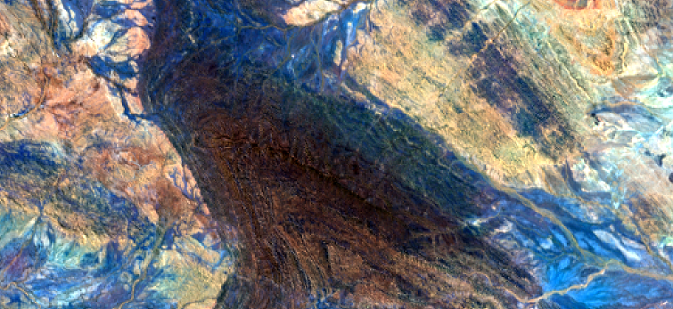
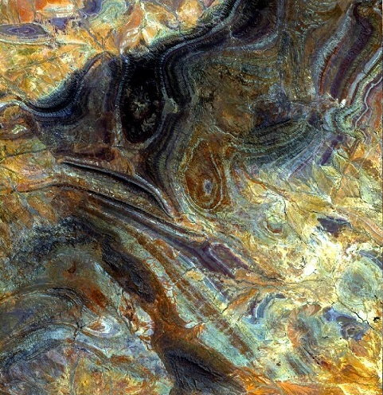
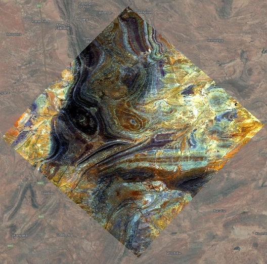

# Processing NetCDF file

Other than ENVI and HDF5, NetCDF support is added for reading. Meanwhile, Geographic Lookup Table (GLT) of raster image can be used to reproject input image.

Configuration json file is slightly different from the basic configuration (an example for topo correction: [nc_topo_correct_config.json](../examples/configs/nc_topo_correct_config.json)). 

## Topograhic Correction

NetCDF and its OBS files can be accessed to implement the basic normalization like topographic correction. Configuration file can be steup like below. anc_files can be eaither nc format or envi format.


```json
   "anc_files": {
      "/data/EMIT/EMIT_L2A_RFL_001_20231101T024133_2330502_014.nc": {
         "path_length": [
            "/data/EMIT/EMIT_L1B_OBS_001_20231101T024133_2330502_014.nc",
            0
         ],
         "sensor_az": [
            "/data/EMIT/EMIT_L1B_OBS_001_20231101T024133_2330502_014.nc",
            1
         ],
         "sensor_zn": [
            "/data/EMIT/EMIT_L1B_OBS_001_20231101T024133_2330502_014.nc",
            2
         ],
         "solar_az": [
            "/data/EMIT/EMIT_L1B_OBS_001_20231101T024133_2330502_014.nc",
            3
         ],
         "solar_zn": [
            "/data/EMIT/EMIT_L1B_OBS_001_20231101T024133_2330502_014.nc",
            4
         ],
         "phase": [
            "/data/EMIT/EMIT_L1B_OBS_001_20231101T024133_2330502_014.nc",
            5
         ],
         "slope": [
            "/data/EMIT/EMIT_L1B_OBS_001_20231101T024133_2330502_014_nc_warp_v1.bsq",
            0
         ],
         "aspect": [
            "/data/EMIT/EMIT_L1B_OBS_001_20231101T024133_2330502_014_nc_warp_v1.bsq",
            1
         ],
         "cosine_i": [
            "/data/EMIT/EMIT_L1B_OBS_001_20231101T024133_2330502_014_nc_warp_v1.bsq",
            2
         ],
         "utc_time": [
            "/data/EMIT/EMIT_L1B_OBS_001_20231101T024133_2330502_014.nc",
            9
         ]
      } 
   },

```

There is a sample image correct script for nc files and GLT ( [image_correct_with_glt.py](../scripts/image_correct_with_glt.py)).

```bash
python ./scripts/image_correct_with_glt.py path/to/the/configuration/json/file
```

Before and after topo correction




## External GLT

Many NetCDF files have internal GLT, but sometime a geo-rectification is needed, and a new corrected GLT can be used for warping the pixels to new geographic positions.


If internal GLT is used, set a blank glt file path
```json
     ... ...
   }, 
   "glt_files": { },
   "export": {
    ... ...
```

External GLT can be specified in the configuration file, it should have at least two bands: GLT_X and GLT_Y
```json
     ... ...
   }, 
   "glt_files": {
      "/data/EMIT/EMIT_L2A_RFL_001_20231101T024133_2330502_014.nc": { 
         "glt_x": ["/data/EMIT/EMIT_L2A_RFL_001_20231101T024133_2330502_014_glt.bsq",1],
         "glt_y": ["/data/EMIT/EMIT_L2A_RFL_001_20231101T024133_2330502_014_glt.bsq",0]
      }
   },
   "export": {
    ... ...
```


To use GLT to warp image or not is controlled by ```use_glt``` in ```export```.
```json
   "export": {
      ...
      "image": true,
      "use_glt":true,
      ...
   },   
```

Export without using GLT



Export warpped image with GLT



